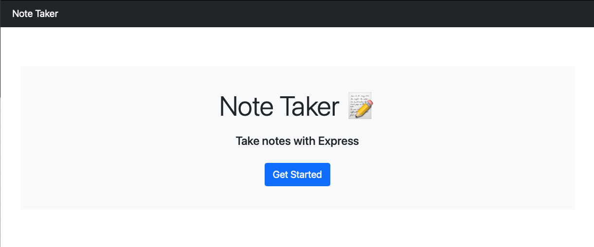
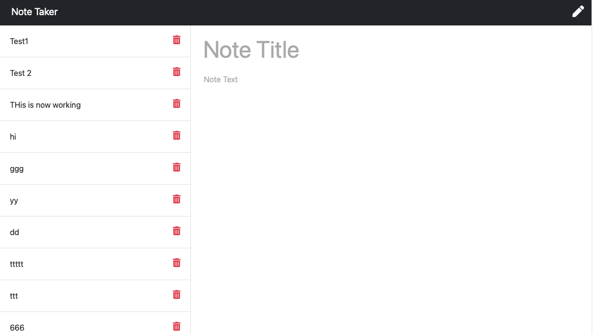
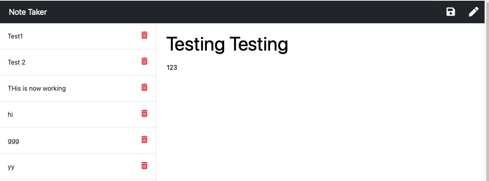
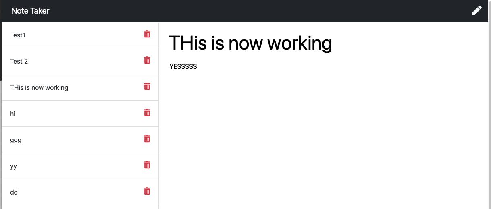
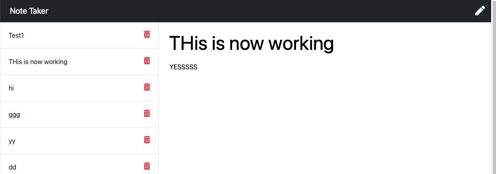

# Note Taker Application 
  

## Table of Contents 
- [Note Taker Application](#note-taker-application)
  - [Table of Contents](#table-of-contents)
  - [Description](#description)
  - [Installation Instructions](#installation-instructions)
  - [Usage](#usage)
  - [Licensing](#licensing)
  - [Contributing](#contributing)
  - [Tests Code](#tests-code)
  - [Pictures](#pictures)
  - [Access to Functional Applicaton](#access-to-functional-applicaton)
  - [Questions](#questions)
    
## Description
    This application was designed to be a simple note taker.  You can add notes of things you would like to be reminded of or things that need to be done.  Notes can be saved and reviewed at a later date.  Once those items are done or completed, the saved note can be deleted and additional notes can be added at anytime.
    
## Installation Instructions 
    There are no installation instructions required.  The note is access via the web on a computer or mobile device.

## Usage
    The application can be used to record things that need to be completed (to-do's) or track reminders.  Once a note is entered it can be saved and will appear on a list of saved notes on the left.  Saved notes can be called back to the main applicaton on the right to be reviewed or updated.  Saved notes can also be deleted once they are completed or no longer required.  Additonal notes can be added once you land on the note taker page or by clicking the pen if you are currently reviewing an existing note.
    
## Licensing
      

    
## Contributing
    Contributions to this application are welcome.  There are no restrictions on upgrading and improving this application.
    
## Tests Code
    To test the applcition, please load the web link and enter the application past the ladning page.  From here, you can add and delete a note as well as clicking on saved notes to have them render on the main page on the right.
    
## Pictures

Please find screenshots and a brief video showcasing the application below

## Access to Functional Applicaton

A functioning version of the application can be found here [Heroku](https://bthnotetaker.herokuapp.com/notes.html)

## Questions
    
You can find me here on [GitHub](http://github.com/daze77), or contact me via [email](mailto:daze77@gmail.com)  
    